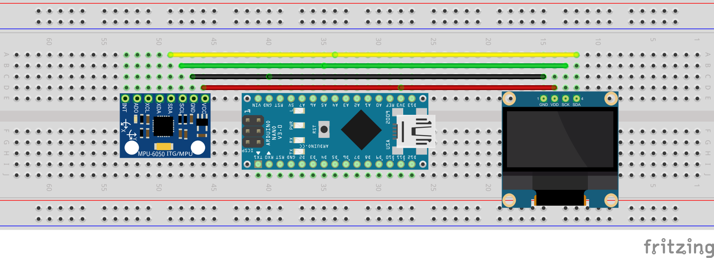

# Arduine_MPU6050_SSD1306

Arduinoにi2c接続したSSD1306に姿勢表示をする．

## 必須ライブラリ

* imuFilter
* basicMPU6050
* U8glib

imuFilter/examples/heading/heading.ino を改変したもの．

## 機能
- X/Y/Z の姿勢をrad/degで表示する
- 温度を表示する

## 精度

- X/Z 0.01 deg 程度
- Y 0.02 - 0.03 deg程度，時間がたつと多少ドリフトする．

## 配置

</img>  

## 参考

- [imuFilter](https://github.com/RCmags/imuFilter)
- [basicMPU6050](https://github.com/RCmags/basicMPU6050)
- [U8glib](https://github.com/olikraus/u8glib)
